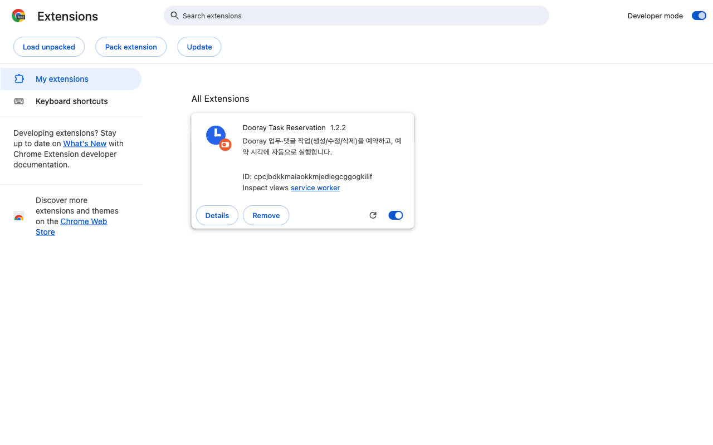
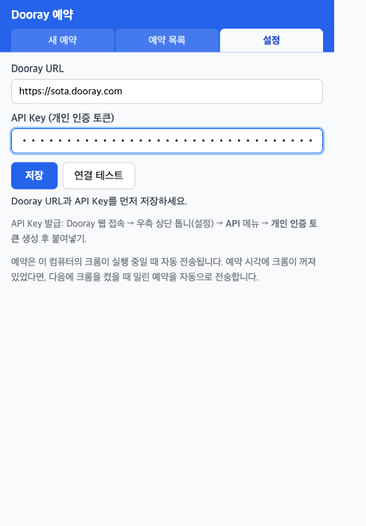
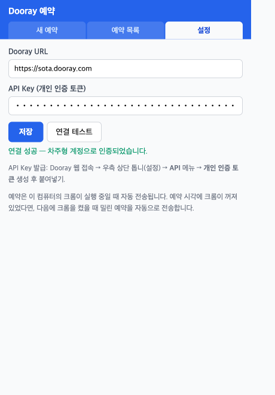
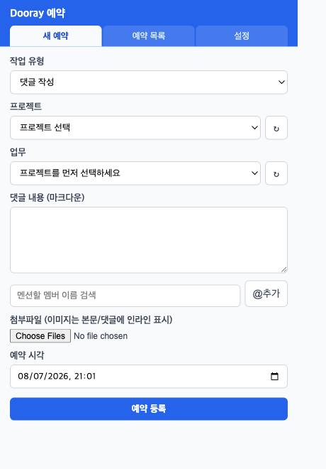
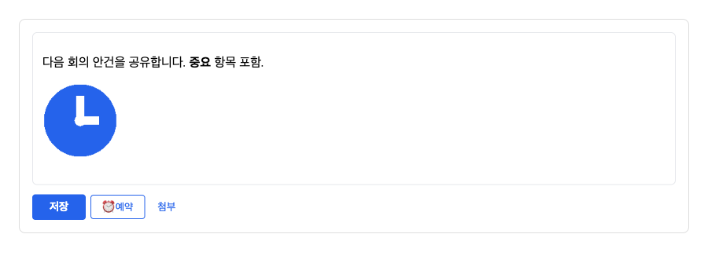
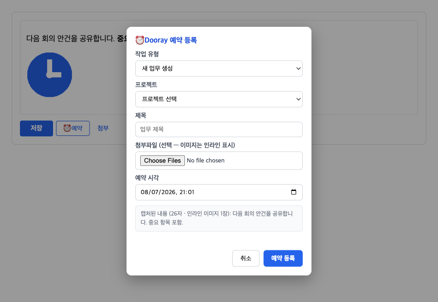

# 설치 및 사용 가이드

> 이 문서의 스크린샷은 실제 브라우저(Chromium)에 이 익스텐션을 로드해 실행하면서
> 캡처한 화면입니다. 확장 프로그램 관리 페이지의 메뉴 이름은 크롬 언어 설정에 따라
> 영어(Load unpacked) 또는 한국어(압축해제된 확장 프로그램을 로드)로 표시됩니다.

## 1. 준비물

- **Chrome 브라우저** (Manifest V3를 지원하는 최신 버전)
- **이 저장소의 소스 코드** — 둘 중 편한 방법으로 받습니다:

  ```bash
  # 방법 A: git
  git clone https://github.com/Piorosen/dooray-task-reservation.git
  ```

  방법 B: GitHub 페이지에서 **Code → Download ZIP** 을 받아 압축을 풀어 둡니다.
  (설치 후에도 이 폴더를 지우면 안 됩니다 — 크롬이 이 폴더를 직접 읽습니다.)

## 2. 크롬에 익스텐션 설치

1. 크롬 주소창에 `chrome://extensions` 를 입력해 확장 프로그램 관리 페이지를 엽니다.
2. **우측 상단의 "개발자 모드"(Developer mode) 토글을 켭니다.**
3. 왼쪽 상단에 나타난 **"압축해제된 확장 프로그램을 로드"(Load unpacked)** 버튼을
   클릭하고, 1번에서 받은 `dooray-task-reservation` 폴더를 선택합니다.
4. 아래처럼 카드가 나타나면 설치 완료입니다.



> 💡 툴바에서 아이콘이 바로 안 보이면, 주소창 오른쪽의 퍼즐 조각(🧩) 아이콘을 눌러
> **Dooray Task Reservation** 옆의 핀(📌)을 클릭해 고정하세요.

## 3. API 키 발급 및 초기 설정

### 3-1. Dooray 개인 인증 토큰 발급

1. 브라우저로 Dooray(예: `https://sota.dooray.com`)에 로그인합니다.
2. **우측 상단 프로필 → 톱니바퀴(설정)** 를 클릭합니다.
3. 왼쪽 메뉴에서 **API** 를 선택합니다.
4. **개인 인증 토큰**(Personal Authentication Token) 항목에서 새 토큰을 생성하고
   복사해 둡니다. (토큰은 생성 직후 한 번만 표시되니 바로 복사하세요.)

### 3-2. 익스텐션에 저장

1. 툴바의 시계 아이콘을 클릭해 팝업을 열면 **설정** 탭이 표시됩니다.
2. **Dooray URL**에 `https://sota.dooray.com` 을, **API Key**에 방금 복사한 토큰을
   붙여넣습니다.



3. **저장**을 누른 뒤 **연결 테스트**를 클릭합니다. 아래처럼 초록색으로
   "연결 성공 — ○○○ 계정으로 인증되었습니다." 가 나오면 준비 완료입니다.



## 4. 사용 방법 A — 팝업에서 예약 등록

**새 예약** 탭에서 모든 작업을 예약할 수 있습니다.



1. **작업 유형** 선택 — 업무 생성 / 업무 수정 / 업무 삭제 / 댓글 작성 / 댓글 수정 / 댓글 삭제
2. **프로젝트 → 업무 → 댓글** 순서로 대상을 선택합니다 (자동으로 목록이 로드되며,
   목록에 없으면 맨 아래 "ID 직접 입력…"을 선택).
3. 내용을 작성합니다. 입력란 아래의 **@추가** 버튼으로 멤버 이름을 검색해
   멘션을 삽입할 수 있고, **첨부파일**에서 여러 파일을 선택할 수 있습니다
   (이미지는 본문/댓글에 인라인으로 표시, 총 25MB 이하).
4. **예약 시각**을 지정하고 **예약 등록**을 누릅니다.
5. **예약 목록** 탭에서 대기/완료/실패 상태를 확인하고, 재시도·삭제·즉시 실행을
   할 수 있습니다. 실행 결과는 크롬 알림으로도 표시됩니다.

## 5. 사용 방법 B — Dooray 페이지에서 바로 예약 (에디터 통합)

Dooray 웹의 에디터(댓글 작성, 본문 수정, 업무 생성) 하단 **저장 버튼 옆에
[⏰ 예약] 버튼이 자동으로 추가**됩니다.



스마트 에디터에 내용(서식·이미지 포함)을 작성한 뒤 **[⏰ 예약]** 을 누르면,
작성 중인 내용이 그대로 캡처된 예약 모달이 열립니다:



- 업무 상세 화면이면 대상 업무가 자동 감지되어 "이 업무에 댓글 작성 / 본문 수정"을
  바로 선택할 수 있습니다.
- 에디터에 삽입한 이미지는 캡처 시 안전하게 확보했다가, 실행 시각에 해당 업무의
  정식 첨부로 재업로드됩니다.
- 모달의 미리보기에 "캡처된 내용 (n자 · 인라인 이미지 n장)"이 표시되는지 확인하세요.

## 6. 동작 방식과 주의사항

| 항목 | 내용 |
|------|------|
| 실행 조건 | 예약 시각에 **이 컴퓨터의 크롬이 실행 중**이어야 전송됩니다 (서버 없음) |
| 밀린 예약 | 예약 시각에 크롬이 꺼져 있었다면, 다음에 크롬을 켰을 때 자동 전송 |
| 첨부 용량 | 예약 1건당 총 25MB 이하 |
| 업무 삭제 | Dooray 공개 API 미지원(실측 404) — 웹 UI에서 직접 삭제 필요 |
| API 키 보관 | 이 브라우저 프로필의 확장 저장소에만 저장, Dooray API 호출에만 사용 |

## 7. 업데이트 방법

```bash
cd dooray-task-reservation && git pull
```

이후 `chrome://extensions` 에서 카드의 **새로고침(↻)** 버튼을 누르고,
열려 있던 Dooray 탭도 새로고침하면 적용됩니다.

## 8. 문제 해결

- **[⏰ 예약] 버튼이 안 보여요** — 익스텐션 새로고침(↻) 후 Dooray 탭을 새로고침하세요.
  에디터가 열려 있는 화면(댓글 입력 등)에서만 나타납니다.
- **예약이 실행되지 않았어요** — 예약 목록 탭에서 상태와 실패 사유를 확인하세요.
  크롬이 꺼져 있었다면 다음 실행 시 자동 전송됩니다.
- **백그라운드 로그 보기** — `chrome://extensions` → 카드의 **"service worker"**
  링크 클릭 → 콘솔에서 오류를 확인할 수 있습니다.
- **팝업 오류 보기** — 팝업을 연 상태에서 우클릭 → **검사** → Console 탭.
- **연결 실패** — API 토큰이 유효한지(재발급 여부), URL이 정확한지 확인하세요.
